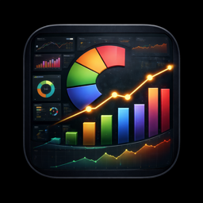

<p align="center">
  
</p>

<h1 align="center">GrafLens</h1>

<p align="center">
  A native iOS, iPadOS, and macOS app for viewing Grafana dashboards.<br>
  Connect to any Grafana instance, browse your dashboards by folder, and view panels with full OIDC/OAuth support.
</p>

## Try the Beta

Test the latest GrafLens builds via TestFlight:

**[Join the beta on TestFlight →](https://testflight.apple.com/join/ZnHaWNhT)**

## Features

- **Multi-server support** - Connect to any Grafana instance with a service account token
- **Dashboard browser** - Browse all dashboards organized by folder with search
- **Panel viewer** - View individual panels rendered via embedded web views
- **OIDC/OAuth login** - Sign in via Authentik, Okta, or any OIDC provider for panel rendering
- **Time range picker** - Switch between 5m, 1h, 6h, 24h, 7d, 30d ranges
- **Data sources view** - See all configured data sources at a glance
- **Full-screen panels** - Tap any panel to expand it
- **Connection persistence** - Saved connections for quick reconnect
- **Universal app** - Runs on iPhone, iPad, and Mac (Catalyst)

## Requirements

- iOS 17.0+ / iPadOS 17.0+ / macOS 14.0+ (Catalyst)
- Xcode 15.0+
- A Grafana instance with a Service Account token

## Getting Started

1. Clone the repo
   ```bash
   git clone https://github.com/whitematter-tech/graflens.git
   ```
2. Open `GrafLens.xcodeproj` in Xcode
3. Select your development team under Signing & Capabilities
4. Build and run

### Creating a Service Account Token

1. Go to your Grafana instance
2. Navigate to **Administration > Service Accounts**
3. Create a new Service Account with **Viewer** role
4. Generate a token and use it in the app

### OIDC/OAuth Panel Viewing

If your Grafana uses OIDC authentication (e.g., Authentik, Okta), panels require a browser session:

1. Connect with your API token (this handles dashboard listing)
2. Open a dashboard and tap **"Sign in to view panels"**
3. Authenticate via your OIDC provider in the web view
4. All panels will now render with your session

## Project Structure

```
GrafLens/
├── GrafLensApp.swift              # App entry point
├── GrafLensShortcuts.swift        # App Intents / Shortcuts
├── Info.plist
├── PrivacyInfo.xcprivacy          # App Store privacy manifest
├── GrafLensProducts.storekit      # StoreKit config for tip jar testing
├── Assets.xcassets/
├── Models/
│   └── GrafanaModels.swift        # API response models + ServerConnection
├── Services/
│   ├── GrafanaAPIClient.swift     # Async/await Grafana REST API client
│   ├── ConnectionManager.swift    # Server connection state & persistence
│   ├── KeychainManager.swift      # API token storage in Keychain
│   ├── WebAuthManager.swift       # Shared WKWebView session for OIDC
│   ├── StoreManager.swift         # StoreKit 2 tip jar
│   ├── AppearanceManager.swift    # Light/dark/system theme
│   ├── FavoritesManager.swift     # Pinned dashboards
│   ├── HapticManager.swift        # Haptic feedback
│   ├── PanelCacheManager.swift    # Panel image cache
│   ├── SharedDataManager.swift    # App Group bridge to widget
│   └── SpotlightManager.swift     # Spotlight indexing for dashboards
├── ViewModels/
│   ├── DashboardListViewModel.swift
│   ├── DashboardDetailViewModel.swift
│   └── AlertsViewModel.swift
└── Views/
    ├── RootView.swift
    ├── ConnectView.swift          # Server connection screen
    ├── ServerSwitcherView.swift   # Switch between saved servers
    ├── MainTabView.swift          # Tab bar navigation
    ├── DashboardListView.swift    # Dashboard list grouped by folder
    ├── DashboardDetailView.swift  # Dashboard with panel cards
    ├── DashboardEditView.swift    # Edit dashboard metadata
    ├── PanelCardView.swift        # Panel rendering via WKWebView
    ├── NativeCharts/              # Native SwiftUI Charts panels
    │   ├── NativeStatPanel.swift
    │   ├── NativeGaugePanel.swift
    │   ├── NativeTimeSeriesPanel.swift
    │   └── NativeBarChartPanel.swift
    ├── DataSourcesView.swift      # Data source list
    ├── AlertsView.swift           # Alert rules list
    ├── SilencesView.swift         # Alert silences list
    ├── CreateSilenceView.swift
    ├── CreateAnnotationView.swift
    ├── SnapshotsView.swift        # Dashboard snapshots
    ├── PlaylistsView.swift        # Dashboard playlists
    ├── FolderManagementView.swift
    ├── GrafanaLoginView.swift     # OIDC login web view
    ├── SettingsView.swift         # Settings, tip jar, GitHub link
    └── BannerAdView.swift         # Tip jar UI

GrafLensWidget/
├── GrafLensWidget.swift           # Home screen widget extension
└── Info.plist
```

> The widget shares data with the main app via the `group.tech.whitematter.graflens` App Group. After cloning, you'll need to enable the App Groups capability for both targets under Signing & Capabilities and select your own development team.

## Contributing

Contributions are welcome! Please open an issue or submit a pull request.

## Support

GrafLens is free and open source with no ads. If you find it useful, you can leave a tip via the in-app tip jar or [sponsor on GitHub](https://github.com/sponsors/whitematter-tech).

## License

[MIT](LICENSE)
